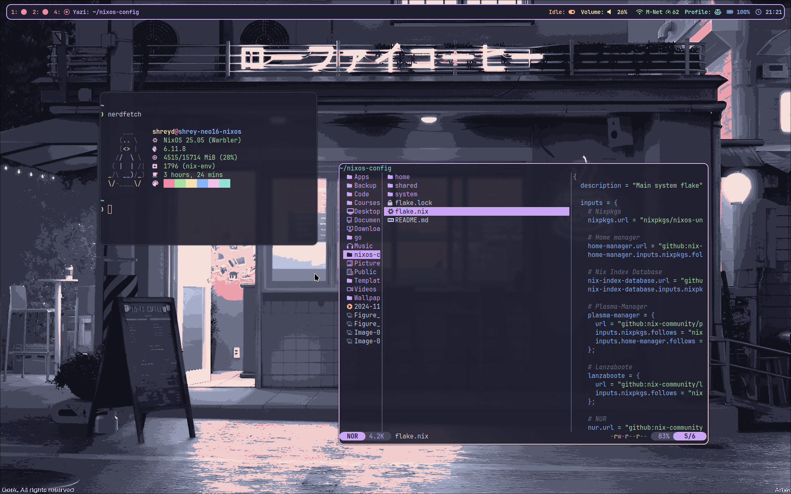

# ❄️ `NullAdmin1`'s NixOS Flakes ❄️

## Highlights:
* Multi-host config, with a base NixOS Installation and `WSL`
* Fully riced `Hyprland` Desktop Environment Setup (with the Hypr ecosystem)
* Themed with `Catppuccin`
* One-click enable `Gnome`, `KDE Plasma`, `Wayfire`, and other Desktop Environments
* Disk configuration Managed with `Disko`
* `BTRFS` Setup
* Everything is *mostly* declarative (except `plasma-manager`)
* Fully-fledged `Nixvim` configuration
* Secrets using `sops-nix`

## 🖼️ Gallery
### Hyprland Rice

## WIP/TODO:
* More desktop environments
* `plasma-manager`
* Add support for AMD Stuff
