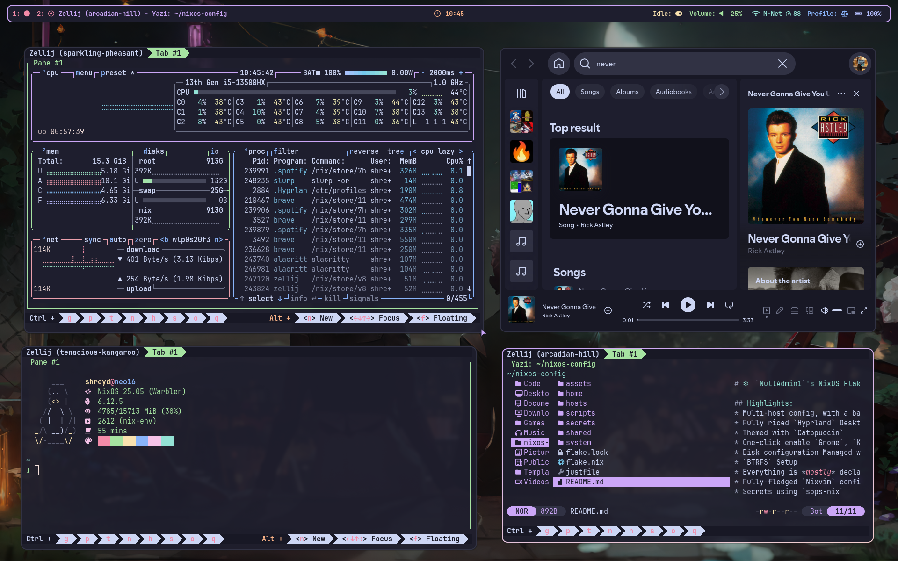

# ❄️ `NullAdmin1`'s NixOS Flakes ❄️

## Highlights:

- Multi-host config, with a base NixOS Installation and `WSL`
- Fully riced `Hyprland` Desktop Environment Setup (with the Hypr ecosystem)
- Themed with `Catppuccin`
- One-click enable `Gnome`, `KDE Plasma`, `Wayfire`, and other Desktop Environments
- Disk configuration Managed with `Disko`
- `BTRFS` Setup
- Everything is _mostly_ declarative (except `plasma-manager`)
- Fully-fledged `Nixvim` configuration
- Secrets using `sops-nix`

## 🖼️ Gallery

### Hyprland Rice

## WIP/TODO:

- More desktop environments
- `plasma-manager`
- Add support for AMD Stuff
- Modularize config more
- Implement the use of [nixos-facter](https://github.com/numtide/nixos-facter)
